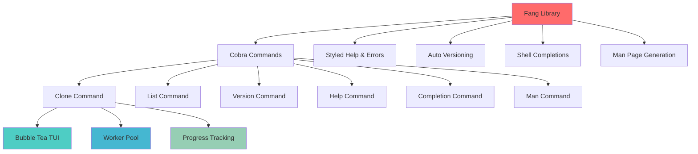
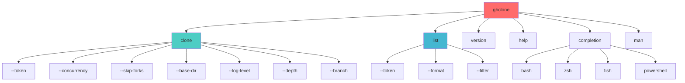
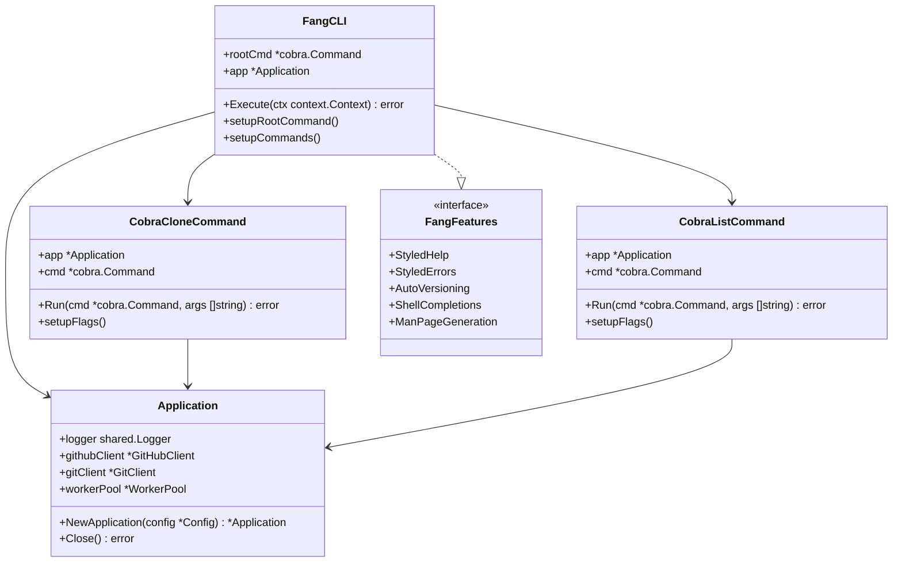
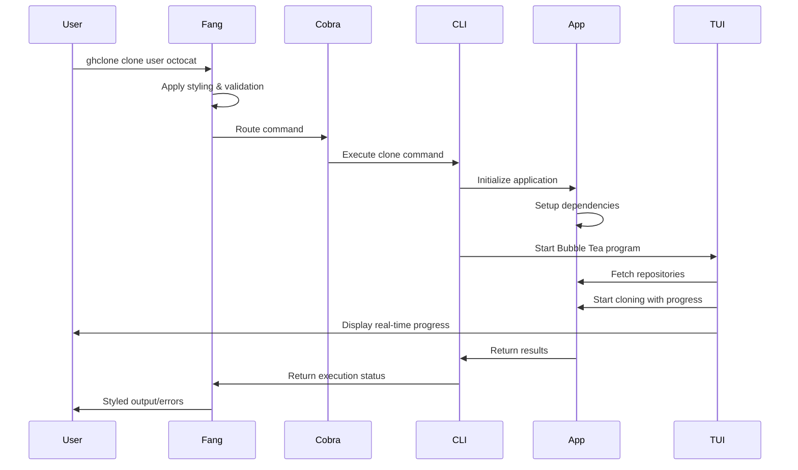
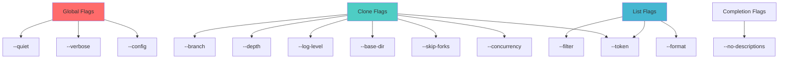
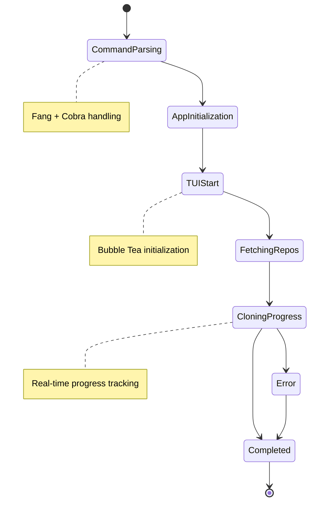
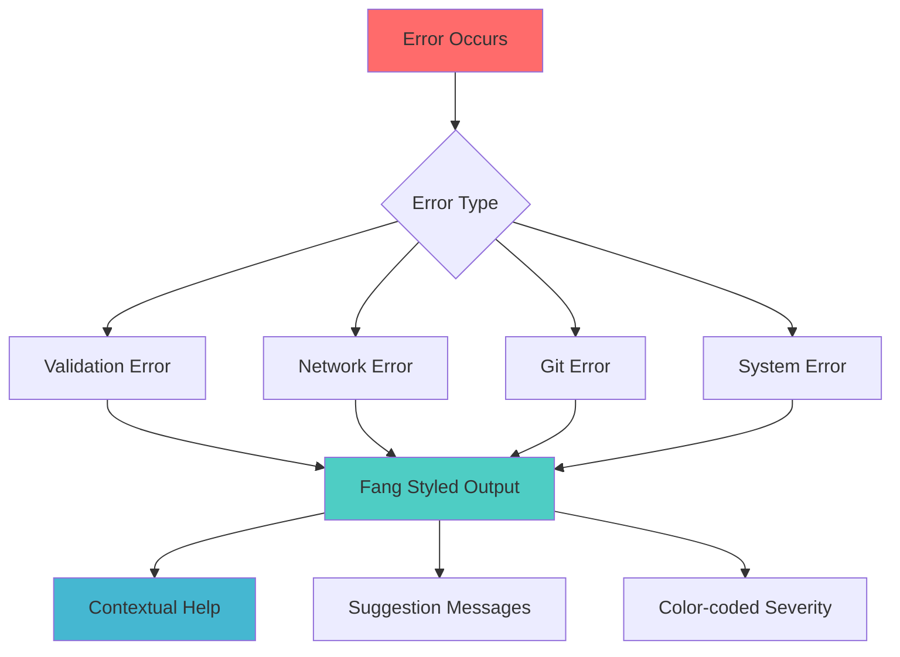

# Fang Integration Design

## Overview

This design document outlines the integration of Charmbracelet's Fang library into the ghclone CLI application. Fang is a batteries-included Cobra CLI starter kit that provides enhanced styling, automatic versioning, man page generation, shell completions, and improved error handling for command-line applications.

The integration will transform the current custom CLI command system into a modern, styled Cobra-based CLI while maintaining all existing functionality and improving the user experience with enhanced visual output and standard CLI conventions.

## Technology Stack & Dependencies

### Current Dependencies
- **Bubble Tea**: TUI framework for interactive progress display
- **Bubbles**: UI components (progress bars, inputs)
- **Lipgloss**: Terminal styling library
- **Custom CLI System**: Manual argument parsing and command routing

### New Dependencies
- **github.com/charmbracelet/fang**: CLI starter kit with Cobra integration
- **github.com/spf13/cobra**: Command-line interface framework
- **Automatic Integration**: Fang brings styled help pages, error handling, versioning, and completions

### Dependency Relationship



## Architecture

### Command Structure Transformation

The integration will replace the current custom command system with a structured Cobra-based hierarchy that leverages Fang's enhanced styling and functionality.

#### Current Architecture
```
main.go (custom arg parsing) → CLIApplication → Command interface → Individual commands
```

#### New Fang-Integrated Architecture
```
main.go → fang.Execute(rootCmd) → Cobra commands → Business logic
```

### Root Command Structure



### Core Components Integration

#### 1. Main Entry Point
- Replace custom argument parsing with `fang.Execute()`
- Configure root command with application metadata
- Integrate with existing dependency injection system

#### 2. Command Migration
- Transform existing Command interface implementations to Cobra commands
- Preserve all current functionality and options
- Add Fang's enhanced styling to help and error output

#### 3. TUI Integration Preservation
- Maintain Bubble Tea integration for progress tracking
- Keep existing worker pool and concurrency patterns
- Preserve real-time logging and progress display

## Component Architecture

### Fang Integration Layer



### Command Execution Flow



## Routing & Navigation

### Command Routing

#### Root Command Configuration
- **Use**: `ghclone`
- **Short**: "Concurrent GitHub Repository Cloner"
- **Long**: Detailed description with examples and features
- **Version**: Integrated with build information via Fang

#### Command Hierarchy

| Command | Description | Flags | Subcommands |
|---------|-------------|-------|-------------|
| `clone` | Clone repositories | --token, --concurrency, --skip-forks, --base-dir, --log-level, --depth, --branch | None |
| `list` | List repositories | --token, --format, --filter | None |
| `version` | Show version info | None | None |
| `help` | Show help | None | Any command |
| `completion` | Generate completions | None | bash, zsh, fish, powershell |
| `man` | Generate man pages | None | None |

### Flag Inheritance and Validation



## Styling Strategy

### Fang Styling Integration

#### Enhanced Help Output
- Styled command descriptions with consistent formatting
- Color-coded examples and usage patterns
- Professional terminal output with Lipgloss integration
- Consistent spacing and typography

#### Error Handling Enhancement
- Styled error messages with contextual information
- Clear error categorization (validation, network, git, etc.)
- Helpful suggestions and troubleshooting hints
- Color-coded severity levels

#### Theme Configuration
```go
type FangTheme struct {
    Primary   lipgloss.Color
    Secondary lipgloss.Color
    Success   lipgloss.Color
    Warning   lipgloss.Color
    Error     lipgloss.Color
    Muted     lipgloss.Color
}
```

### TUI Styling Preservation
- Maintain existing Bubble Tea progress bar styling
- Preserve real-time logging display formatting
- Keep color-coded status indicators
- Integrate Fang styling with TUI components

## State Management

### Configuration Management

#### Fang Configuration Integration
```go
type FangConfig struct {
    AppName     string
    Version     string
    Description string
    Author      string
    License     string
    Homepage    string
}
```

#### Command State Management
- Preserve existing Application struct and dependency injection
- Integrate Cobra command context with business logic
- Maintain separation between CLI layer and application core
- Support configuration file integration (future enhancement)

### TUI State Preservation



## API Integration Layer

### GitHub API Integration Preservation
- Maintain existing GitHubClient implementation
- Preserve rate limiting and authentication logic
- Keep repository fetching and filtering functionality
- Integrate API errors with Fang's styled error handling

### Git Operations Integration
- Preserve GitClient functionality
- Maintain worker pool concurrency patterns
- Keep progress tracking integration
- Enhance error reporting through Fang styling

## Testing Strategy

### Command Testing
- Unit tests for Cobra command setup and flag parsing
- Integration tests for command execution flow
- Mock application dependencies for isolated testing
- Validate Fang integration points

### TUI Testing Preservation
- Maintain existing Bubble Tea model testing
- Keep progress tracking and worker pool tests
- Preserve integration test coverage
- Add Fang-specific CLI behavior tests

### Test Structure
```
tests/
├── cmd/
│   ├── clone_test.go
│   ├── list_test.go
│   └── fang_integration_test.go
├── internal/
│   └── ... (existing tests)
└── integration/
    ├── cli_integration_test.go
    └── tui_integration_test.go
```

## Migration Implementation Plan

### Phase 1: Dependency Integration
1. Add Fang and Cobra dependencies to go.mod
2. Create basic root command structure
3. Implement main.go integration with fang.Execute()

### Phase 2: Command Migration
1. Transform CloneCommand to Cobra command
2. Migrate ListCommand to Cobra structure
3. Implement version, help, completion, and man commands
4. Preserve all existing flags and functionality

### Phase 3: Styling Integration
1. Apply Fang's styled help and error handling
2. Integrate custom theme configuration
3. Ensure TUI compatibility with Fang styling
4. Implement consistent error reporting

### Phase 4: Enhancement Features
1. Add shell completion generation
2. Implement man page generation
3. Add configuration file support
4. Enhance error messages with contextual help

### Phase 5: Testing and Validation
1. Comprehensive CLI testing
2. TUI integration validation
3. Performance impact assessment
4. User experience testing

## Error Handling Enhancement

### Fang Error Integration



### Error Categories and Styling
- **Validation Errors**: Red highlighting with usage examples
- **Network Errors**: Yellow warnings with connectivity suggestions
- **Git Errors**: Orange alerts with git troubleshooting hints
- **System Errors**: Red errors with system requirement information

## Performance Considerations

### Fang Integration Impact
- Minimal performance overhead from Cobra command routing
- Preserved TUI performance with Bubble Tea
- Maintained worker pool efficiency
- No impact on git operation performance

### Memory and CPU Usage
- Cobra command structure adds minimal memory overhead
- Fang styling operations are lightweight
- TUI and progress tracking performance unchanged
- Worker pool concurrency patterns preserved

## Configuration Integration

### Command-line Configuration
```yaml
# Future: .ghclone.yaml
github:
  token: "${GITHUB_TOKEN}"
  api_url: "https://api.github.com"

cloning:
  concurrency: 4
  skip_forks: true
  depth: 1
  base_dir: "./repos"

logging:
  level: "info"
  file: "logs/ghclone.log"

ui:
  theme: "default"
  progress_style: "gradient"
```

### Environment Variables
- `GITHUB_TOKEN`: GitHub personal access token
- `GHCLONE_CONFIG`: Custom configuration file path
- `GHCLONE_LOG_LEVEL`: Override log level
- `GHCLONE_CONCURRENCY`: Override worker count