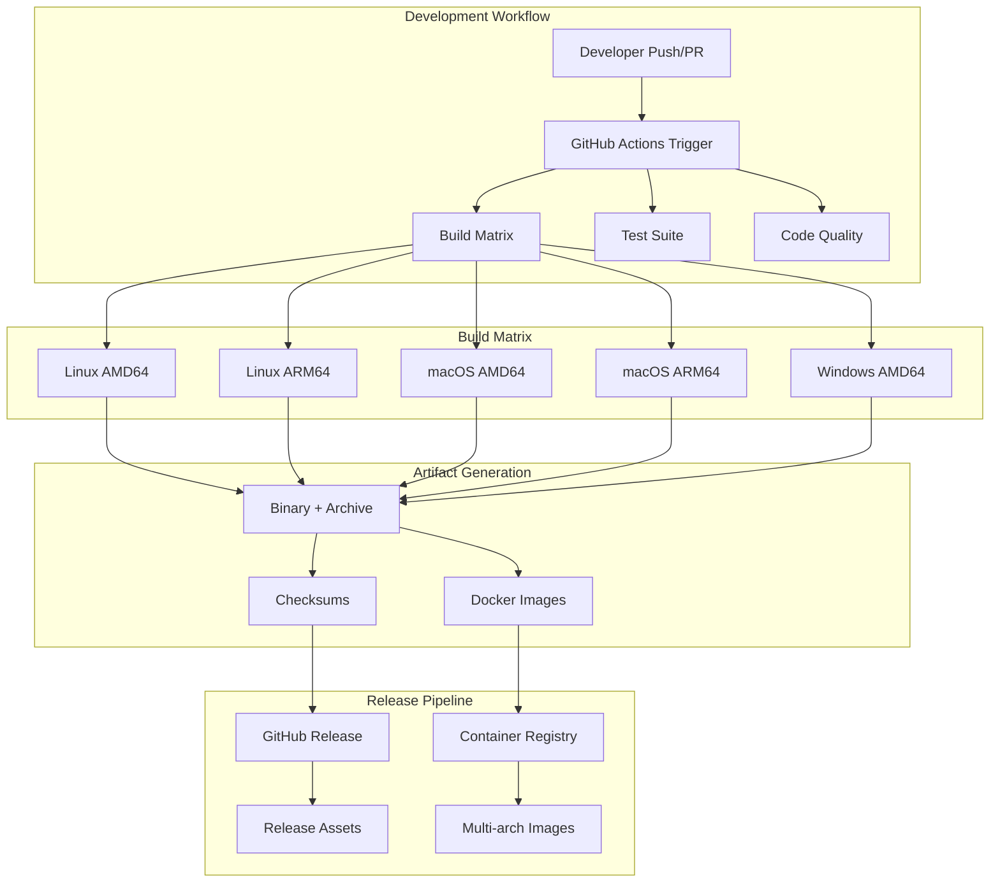
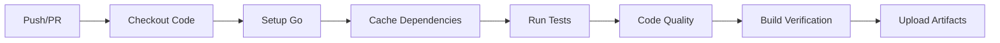
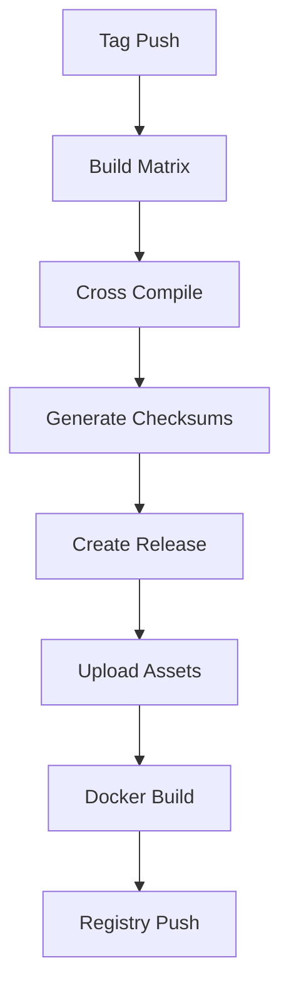
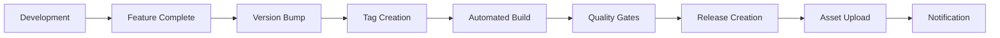

# GitHub Actions CI/CD Setup for ghclone

## Overview

This document outlines the design and implementation of a comprehensive CI/CD pipeline using GitHub Actions for the `ghclone` project, along with a robust Makefile build system. The solution provides automated building, testing, cross-platform compilation, Docker containerization, and release management for the Go-based CLI tool.

## Technology Stack & Dependencies

### Core Technologies
- **Go 1.24.3**: Primary programming language
- **GitHub Actions**: CI/CD orchestration platform
- **Make**: Build automation and task runner
- **Docker/Buildx**: Multi-platform containerization
- **Git**: Version control and release tagging

### Build Dependencies
- **Cross-compilation**: Native Go cross-compilation support
- **Compression**: tar/gzip for Linux/macOS, zip for Windows
- **Checksum Generation**: SHA-256 for release verification
- **Docker Buildx**: Multi-architecture container builds

## Architecture

### Build System Architecture



### File Structure

```
ghclone/
├── .github/
│   └── workflows/
│       ├── ci.yml              # Continuous Integration
│       ├── release.yml         # Release Management
│       └── docker.yml          # Container Builds
├── Makefile                    # Build automation
├── Dockerfile                  # Container definition
├── .dockerignore              # Docker build exclusions
└── .gitignore                 # Git exclusions
```

## Makefile Design

### Configuration Variables

| Variable | Purpose | Default Value |
|----------|---------|---------------|
| `NAME` | Project name | `ghclone` |
| `VERSION` | Release version | Git describe or `v0.1.0` |
| `PACKAGE` | Go module name | `github.com/italoag/ghcloner` |
| `OUTPUT_BIN` | Binary output path | `build/${NAME}` |
| `CGO_ENABLED` | CGO compilation | `0` (static builds) |
| `BUILD_PLATFORMS` | Target platforms | `linux/amd64,linux/arm64,darwin/amd64,darwin/arm64,windows/amd64` |

### Build Targets

#### Core Build Targets
- **`build`**: Single platform build for development
- **`build-static`**: Static binary with no CGO dependencies
- **`build-all`**: Cross-platform builds for all supported architectures
- **`build-linux`**: Linux-specific builds (amd64, arm64)
- **`build-darwin`**: macOS-specific builds (amd64, arm64)
- **`build-windows`**: Windows build (amd64)

#### Testing Targets
- **`test`**: Comprehensive test suite with race detection
- **`test-fast`**: Quick development tests
- **`bench`**: Performance benchmarking
- **`cover`**: Test coverage analysis

#### Code Quality Targets
- **`lint`**: Static analysis with golangci-lint
- **`fmt`**: Code formatting
- **`vet`**: Go vet analysis
- **`mod`**: Dependency management

### Cross-Platform Build Strategy

The Makefile implements sophisticated cross-compilation using Go's native capabilities:

```makefile
define build_platform
	$(eval GOOS := $(word 1,$(subst /, ,$(1))))
	$(eval GOARCH := $(word 2,$(subst /, ,$(1))))
	$(eval EXT := $(if $(filter windows,$(GOOS)),.exe,))
	$(eval OUTPUT := ${DIST_DIR}/${NAME}-${VERSION}-$(GOOS)-$(GOARCH)$(EXT))
	$(eval ARCHIVE := $(if $(filter windows,$(GOOS)),${DIST_DIR}/${NAME}-${VERSION}-$(GOOS)-$(GOARCH).zip,${DIST_DIR}/${NAME}-${VERSION}-$(GOOS)-$(GOARCH).tar.gz))
endef
```

### Version Management

```makefile
VERSION := $(shell git describe --tags --always --dirty 2>/dev/null || echo "v0.1.0")
GIT_REV := $(shell git rev-parse --short HEAD 2>/dev/null || echo "unknown")
DATE := $(shell date -u +"%Y-%m-%dT%H:%M:%SZ")

LDFLAGS := -w -s \
           -X main.version=${VERSION} \
           -X main.commit=${GIT_REV} \
           -X main.date=${DATE}
```

## GitHub Actions Workflows

### Continuous Integration Workflow (ci.yml)



#### Trigger Conditions
- **Push**: `main`, `develop` branches
- **Pull Request**: All branches targeting `main`
- **Manual**: `workflow_dispatch` for manual triggers

#### Build Matrix
- **Go Versions**: 1.24.x (primary), 1.23.x (compatibility)
- **Operating Systems**: `ubuntu-latest`, `macos-latest`, `windows-latest`
- **Architecture**: Native platform testing

#### Quality Gates
- **Unit Tests**: Comprehensive test suite with race detection
- **Coverage**: Minimum 80% code coverage requirement
- **Linting**: golangci-lint with strict configuration
- **Security**: gosec security scanner
- **Vulnerability**: govulncheck for dependency scanning

### Release Workflow (release.yml)



#### Release Triggers
- **Tag Push**: Semantic version tags (v*.*.*)
- **Pre-release**: Tags with suffixes (-alpha, -beta, -rc)

#### Asset Generation
- **Binary Archives**: Compressed archives for each platform
- **Checksums**: SHA-256 verification files
- **Release Notes**: Auto-generated from commit history
- **Docker Images**: Multi-architecture container images

### Container Workflow (docker.yml)

#### Multi-Platform Strategy
- **Platforms**: `linux/amd64`, `linux/arm64`
- **Base Images**: `alpine:latest` for minimal footprint
- **Registry**: GitHub Container Registry (ghcr.io)
- **Tagging**: Version tags + latest for releases

## Docker Configuration

### Dockerfile Design

```dockerfile
# Multi-stage build for optimal image size
FROM golang:1.24-alpine AS builder

# Build environment setup
WORKDIR /app
COPY go.mod go.sum ./
RUN go mod download

# Application build
COPY . .
RUN CGO_ENABLED=0 GOOS=linux go build \
    -a -installsuffix cgo \
    -ldflags '-extldflags "-static"' \
    -o ghclone ./cmd/ghclone

# Production image
FROM alpine:latest
RUN apk --no-cache add ca-certificates git
WORKDIR /root/

COPY --from=builder /app/ghclone .
ENTRYPOINT ["./ghclone"]
```

### Image Optimization
- **Multi-stage Build**: Separate build and runtime environments
- **Alpine Base**: Minimal attack surface and size
- **Static Linking**: No runtime dependencies
- **Security**: Non-root user execution
- **Git Integration**: Git client for clone operations

## Security Considerations

### Secrets Management
- **GitHub Token**: Automated release creation
- **Registry Credentials**: Container image publishing
- **Signing Keys**: Artifact signing (future enhancement)

### Build Security
- **Dependency Pinning**: Exact version specifications
- **Vulnerability Scanning**: Automated security checks
- **Supply Chain**: Verified build environments
- **Artifact Verification**: Checksum validation

## Testing Strategy

### Test Categories

#### Unit Tests
- **Domain Logic**: Business rule validation
- **Services**: Application service testing  
- **Infrastructure**: External integration testing
- **Interfaces**: CLI/TUI interaction testing

#### Integration Tests
- **Git Operations**: Repository cloning functionality
- **GitHub API**: External service integration
- **File System**: Cross-platform compatibility
- **Concurrency**: Worker pool behavior

#### Performance Tests
- **Benchmarking**: Performance regression detection
- **Memory Usage**: Resource consumption monitoring
- **Concurrency**: Scalability validation

### Test Execution Matrix

| Test Type | Frequency | Platforms | Coverage Target |
|-----------|-----------|-----------|-----------------|
| Unit | Every commit | All | >90% |
| Integration | Daily/Release | Linux/macOS | >80% |
| Performance | Weekly | Linux | Baseline |

## Release Management

### Semantic Versioning
- **Major**: Breaking changes (v2.0.0)
- **Minor**: New features (v1.1.0) 
- **Patch**: Bug fixes (v1.0.1)
- **Pre-release**: Alpha/beta/rc suffixes

### Release Process



### Automated Release Features
- **Changelog Generation**: From conventional commits
- **Asset Uploading**: All platform binaries
- **Container Publishing**: Multi-arch images
- **Notification**: Slack/Discord integration (configurable)

## Performance Optimizations

### Build Performance
- **Dependency Caching**: Go module cache across runs
- **Parallel Builds**: Matrix strategy for concurrent builds
- **Incremental Builds**: Change detection for efficiency
- **Artifact Reuse**: Binary sharing between workflows

### Runtime Performance  
- **Static Linking**: Minimal runtime dependencies
- **Optimized Binaries**: Size and speed optimizations
- **Container Layers**: Efficient Docker layer caching
- **Resource Limits**: Controlled resource usage

## Monitoring & Observability

### Build Metrics
- **Success Rate**: Build success percentage
- **Duration**: Build time tracking
- **Artifact Size**: Binary size monitoring
- **Test Coverage**: Coverage trend analysis

### Release Metrics
- **Download Statistics**: Release adoption tracking
- **Platform Distribution**: Usage by architecture
- **Version Adoption**: Update pattern analysis

## Troubleshooting

### Common Build Issues

| Issue | Cause | Solution |
|-------|-------|----------|
| CGO Compilation Failures | Platform-specific CGO | Use CGO_ENABLED=0 |
| Cross-compilation Errors | Missing build constraints | Add platform build tags |
| Large Binary Sizes | Debug symbols included | Use `-ldflags="-s -w"` |
| Test Failures | Race conditions | Run with `-race` flag |

### Debug Strategies
- **Verbose Logging**: Detailed build output
- **Artifact Inspection**: Binary analysis tools
- **Environment Debugging**: Build environment validation
- **Dependency Analysis**: Module version conflicts

## Future Enhancements

### Planned Improvements
- **Code Signing**: Binary signing for security
- **Package Managers**: Homebrew/Chocolatey integration
- **Performance Monitoring**: Benchmark regression detection
- **Security Scanning**: Enhanced vulnerability detection
- **Documentation**: Auto-generated API docs

### Extensibility
- **Plugin Architecture**: Custom build steps
- **Notification Systems**: Multiple notification channels
- **Quality Gates**: Configurable quality thresholds
- **Deployment Targets**: Multiple distribution channels