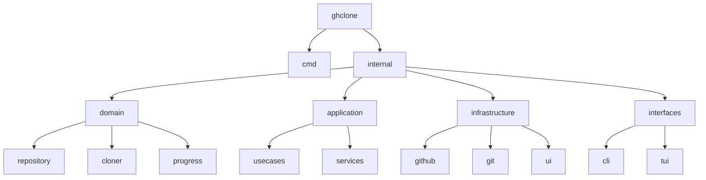
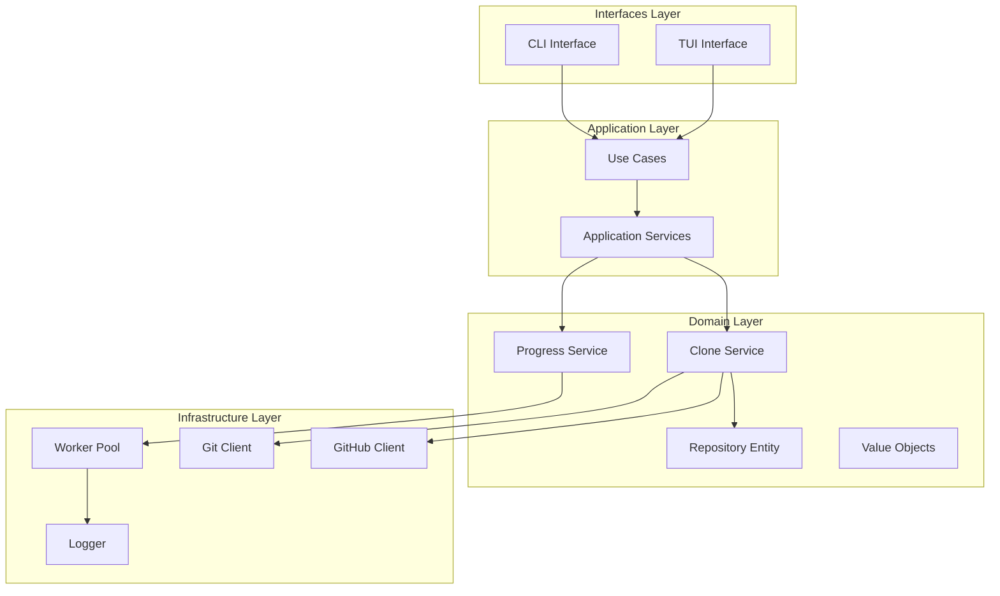
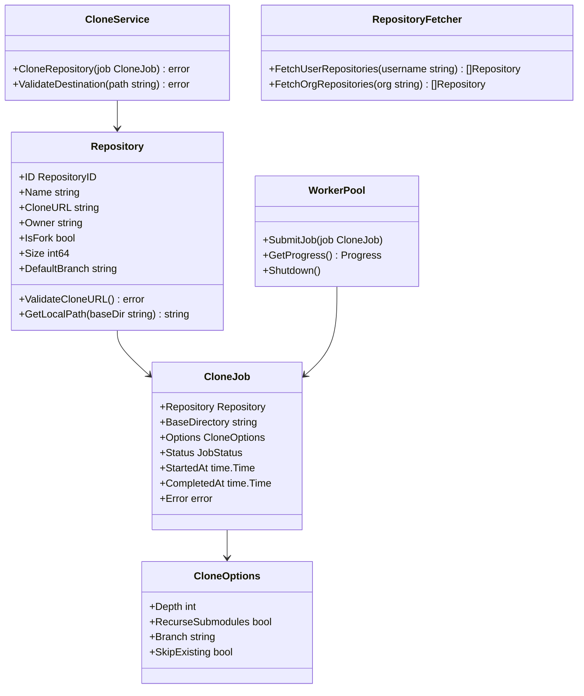
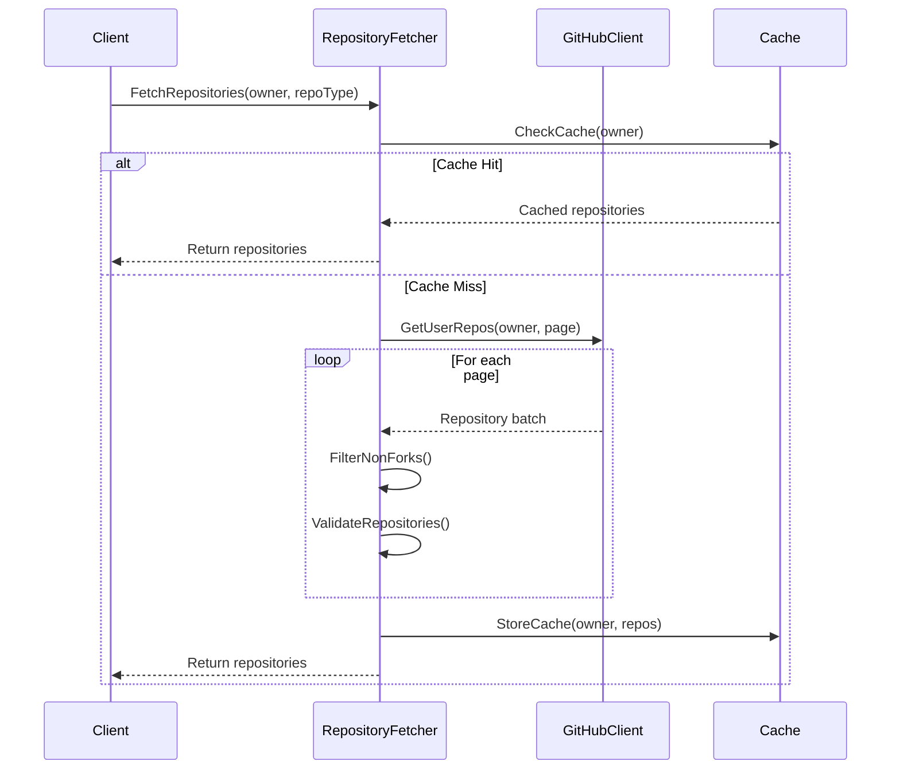
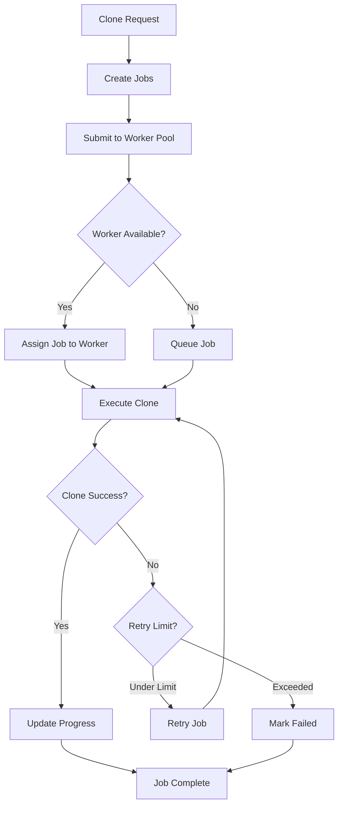
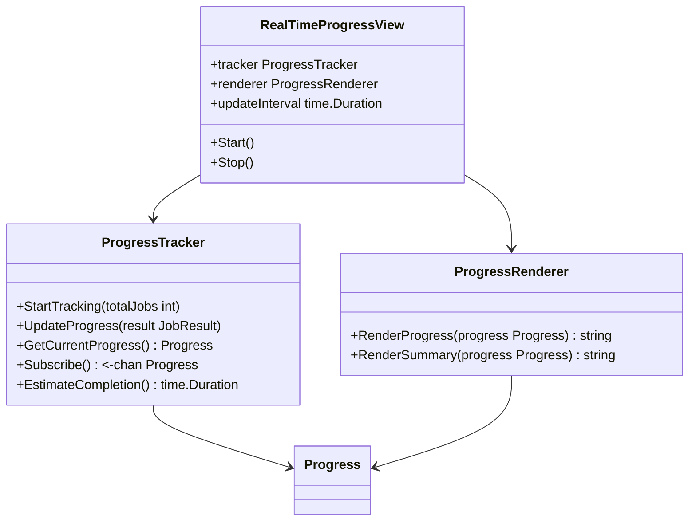
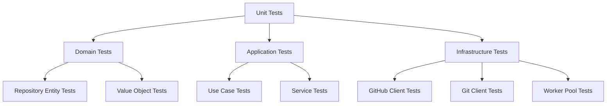

# Go Concurrent Optimizations Design

## Overview

This design outlines comprehensive optimizations for the ghclone project, transforming it from a sequential monolithic application into a highly concurrent, well-architected tool that follows Go conventions, SOLID principles, clean code practices, and Domain-Driven Design (DDD) patterns.

### Current State Analysis

The existing codebase has several areas for improvement:
- **Sequential Processing**: Repositories are cloned one at a time
- **Monolithic Structure**: All logic in a single main.go file
- **Mixed Responsibilities**: Business logic, UI, and infrastructure concerns intertwined
- **Limited Error Handling**: Single error terminates the entire process
- **No Testability**: Tightly coupled components make unit testing difficult

### Optimization Goals

1. **Concurrency Enhancement**: Implement worker pool pattern using ants library
2. **Architecture Refactoring**: Apply DDD and clean architecture principles
3. **SOLID Compliance**: Ensure each component has a single responsibility
4. **Clean Code**: Improve readability, maintainability, and testability
5. **Performance**: Reduce execution time through parallelization
6. **Resilience**: Implement robust error handling and recovery

## Technology Stack & Dependencies

### New Dependencies
- `github.com/panjf2000/ants/v2` - Goroutine pool for efficient concurrency
- `go.uber.org/zap` - Structured logging
- `github.com/stretchr/testify` - Testing framework
- `github.com/golang/mock` - Mock generation for testing

### Enhanced Modules


## Architecture

### Domain-Driven Design Structure



### Component Hierarchy



## Data Models & ORM Mapping

### Core Entities

#### Repository Entity
```go
type Repository struct {
    ID            RepositoryID `json:"id"`
    Name          string       `json:"name" validate:"required,min=1"`
    CloneURL      string       `json:"clone_url" validate:"required,url"`
    Owner         string       `json:"owner" validate:"required"`
    IsFork        bool         `json:"fork"`
    Size          int64        `json:"size"`
    DefaultBranch string       `json:"default_branch"`
    Language      string       `json:"language,omitempty"`
    Description   string       `json:"description,omitempty"`
    UpdatedAt     time.Time    `json:"updated_at"`
}
```

#### Clone Job Value Object
```go
type CloneJob struct {
    Repository    Repository
    BaseDirectory string
    Options       CloneOptions
    Status        JobStatus
    StartedAt     time.Time
    CompletedAt   time.Time
    Error         error
    RetryCount    int
}

type JobStatus int

const (
    JobStatusPending JobStatus = iota
    JobStatusRunning
    JobStatusCompleted
    JobStatusFailed
    JobStatusSkipped
)
```

### Progress Tracking Models
```go
type Progress struct {
    Total       int           `json:"total"`
    Completed   int           `json:"completed"`
    Failed      int           `json:"failed"`
    Skipped     int           `json:"skipped"`
    InProgress  int           `json:"in_progress"`
    ElapsedTime time.Duration `json:"elapsed_time"`
    ETA         time.Duration `json:"eta"`
}

type JobResult struct {
    Job       CloneJob
    Duration  time.Duration
    BytesSize int64
}
```

## Business Logic Layer (Architecture of each feature)

### Repository Fetching Service



#### Implementation
```go
type RepositoryFetcher interface {
    FetchUserRepositories(ctx context.Context, username string) ([]Repository, error)
    FetchOrgRepositories(ctx context.Context, org string) ([]Repository, error)
}

type GitHubRepositoryFetcher struct {
    client     GitHubClient
    cache      Cache
    logger     Logger
    rateLimit  RateLimiter
}

func (f *GitHubRepositoryFetcher) FetchUserRepositories(
    ctx context.Context, 
    username string,
) ([]Repository, error) {
    // Implementation with pagination, filtering, and caching
}
```

### Concurrent Cloning Service



#### Worker Pool Implementation
```go
type CloningService struct {
    workerPool   *ants.Pool
    gitClient    GitClient
    progress     ProgressTracker
    logger       Logger
    options      CloneOptions
}

func (s *CloningService) CloneConcurrently(
    ctx context.Context,
    repositories []Repository,
    baseDir string,
) (<-chan JobResult, error) {
    results := make(chan JobResult, len(repositories))
    
    for _, repo := range repositories {
        job := CloneJob{
            Repository:    repo,
            BaseDirectory: baseDir,
            Options:       s.options,
            Status:        JobStatusPending,
        }
        
        err := s.workerPool.Submit(func() {
            s.executeCloneJob(ctx, job, results)
        })
        
        if err != nil {
            return nil, fmt.Errorf("failed to submit job: %w", err)
        }
    }
    
    return results, nil
}
```

### Progress Tracking Service



## API Endpoints Reference

### Internal Service APIs

#### Repository Service
```go
type RepositoryService interface {
    // Fetch repositories with filtering and pagination
    GetRepositories(ctx context.Context, req GetRepositoriesRequest) (*GetRepositoriesResponse, error)
    
    // Validate repository access and permissions
    ValidateRepository(ctx context.Context, repo Repository) error
}

type GetRepositoriesRequest struct {
    Owner      string
    Type       RepositoryType // User or Organization
    Filter     RepositoryFilter
    Pagination PaginationOptions
}

type RepositoryFilter struct {
    IncludeForks    bool
    MinSize         int64
    MaxSize         int64
    Languages       []string
    UpdatedAfter    time.Time
}
```

#### Clone Service API
```go
type CloneService interface {
    // Clone single repository
    CloneRepository(ctx context.Context, req CloneRequest) (*CloneResponse, error)
    
    // Clone multiple repositories concurrently
    CloneBatch(ctx context.Context, req BatchCloneRequest) (<-chan CloneResult, error)
    
    // Get cloning progress
    GetProgress(ctx context.Context, sessionID string) (*Progress, error)
}

type CloneRequest struct {
    Repository Repository
    Destination string
    Options    CloneOptions
}

type BatchCloneRequest struct {
    Repositories []Repository
    BaseDirectory string
    Options      CloneOptions
    Concurrency  int
}
```

### Authentication Requirements

```go
type AuthenticationService interface {
    ValidateToken(ctx context.Context, token string) (*TokenInfo, error)
    GetRateLimits(ctx context.Context, token string) (*RateLimits, error)
}

type TokenInfo struct {
    Username string
    Scopes   []string
    ExpiresAt time.Time
}

type RateLimits struct {
    Limit     int
    Remaining int
    ResetTime time.Time
}
```

## Middleware & Interceptors

### Logging Middleware
```go
type LoggingMiddleware struct {
    logger Logger
}

func (m *LoggingMiddleware) LogRequest(ctx context.Context, operation string) context.Context {
    requestID := generateRequestID()
    ctx = context.WithValue(ctx, "request_id", requestID)
    
    m.logger.Info("operation started",
        zap.String("operation", operation),
        zap.String("request_id", requestID),
    )
    
    return ctx
}
```

### Rate Limiting Middleware
```go
type RateLimitMiddleware struct {
    limiter TokenBucket
}

func (m *RateLimitMiddleware) CheckRateLimit(ctx context.Context) error {
    if !m.limiter.Allow() {
        return ErrRateLimitExceeded
    }
    return nil
}
```

### Circuit Breaker for Git Operations
```go
type CircuitBreakerMiddleware struct {
    breaker CircuitBreaker
}

func (m *CircuitBreakerMiddleware) ExecuteWithCircuitBreaker(
    operation func() error,
) error {
    return m.breaker.Execute(operation)
}
```

## Testing Strategy

### Unit Testing Architecture



#### Test Structure Examples
```go
// Domain layer tests
func TestRepository_ValidateCloneURL(t *testing.T) {
    tests := []struct {
        name    string
        repo    Repository
        wantErr bool
    }{
        {
            name: "valid HTTPS URL",
            repo: Repository{CloneURL: "https://github.com/user/repo.git"},
            wantErr: false,
        },
        {
            name: "invalid URL",
            repo: Repository{CloneURL: "not-a-url"},
            wantErr: true,
        },
    }
    
    for _, tt := range tests {
        t.Run(tt.name, func(t *testing.T) {
            err := tt.repo.ValidateCloneURL()
            assert.Equal(t, tt.wantErr, err != nil)
        })
    }
}

// Application layer tests with mocks
func TestCloningService_CloneConcurrently(t *testing.T) {
    ctrl := gomock.NewController(t)
    defer ctrl.Finish()
    
    mockGitClient := mocks.NewMockGitClient(ctrl)
    mockProgress := mocks.NewMockProgressTracker(ctrl)
    
    service := &CloningService{
        gitClient: mockGitClient,
        progress:  mockProgress,
    }
    
    // Test implementation
}
```

### Integration Testing
```go
func TestGitHubRepositoryFetcher_Integration(t *testing.T) {
    if testing.Short() {
        t.Skip("skipping integration test")
    }
    
    client := NewGitHubClient(TestConfig())
    fetcher := NewGitHubRepositoryFetcher(client)
    
    repos, err := fetcher.FetchUserRepositories(context.Background(), "octocat")
    require.NoError(t, err)
    assert.NotEmpty(t, repos)
}
```

### Benchmark Testing
```go
func BenchmarkConcurrentCloning(b *testing.B) {
    for i := 0; i < b.N; i++ {
        // Benchmark concurrent cloning vs sequential
    }
}

func BenchmarkWorkerPoolPerformance(b *testing.B) {
    pool, _ := ants.NewPool(10)
    defer pool.Release()
    
    b.ResetTimer()
    for i := 0; i < b.N; i++ {
        pool.Submit(func() {
            // Simulate work
        })
    }
}
```

## Refined Project Structure

```
ghclone/
├── cmd/
│   └── ghclone/
│       └── main.go                 # Application entry point
├── internal/
│   ├── domain/
│   │   ├── repository/
│   │   │   ├── entity.go          # Repository entity
│   │   │   ├── value_objects.go   # Repository-related VOs
│   │   │   └── errors.go          # Domain errors
│   │   ├── cloning/
│   │   │   ├── service.go         # Clone domain service
│   │   │   ├── job.go             # Clone job entity
│   │   │   └── progress.go        # Progress value objects
│   │   └── shared/
│   │       └── types.go           # Shared types and interfaces
│   ├── application/
│   │   ├── usecases/
│   │   │   ├── clone_repositories.go
│   │   │   ├── fetch_repositories.go
│   │   │   └── track_progress.go
│   │   └── services/
│   │       ├── repository_service.go
│   │       ├── cloning_service.go
│   │       └── progress_service.go
│   ├── infrastructure/
│   │   ├── github/
│   │   │   ├── client.go          # GitHub API client
│   │   │   ├── repository_fetcher.go
│   │   │   └── rate_limiter.go
│   │   ├── git/
│   │   │   ├── client.go          # Git operations client
│   │   │   └── validator.go
│   │   ├── concurrency/
│   │   │   ├── worker_pool.go     # Ants-based worker pool
│   │   │   └── job_manager.go
│   │   └── logging/
│   │       └── logger.go          # Structured logging
│   └── interfaces/
│       ├── cli/
│       │   ├── commands/
│       │   │   ├── clone.go
│       │   │   └── list.go
│       │   └── flags.go
│       └── tui/
│           ├── models/
│           │   ├── clone_model.go
│           │   └── progress_model.go
│           ├── views/
│           │   ├── progress_view.go
│           │   └── summary_view.go
│           └── app.go
├── configs/
│   ├── config.go                  # Configuration management
│   └── defaults.go               # Default configurations
├── pkg/
│   ├── errors/
│   │   └── errors.go             # Custom error types
│   └── utils/
│       ├── filesystem.go
│       └── validation.go
├── test/
│   ├── integration/
│   │   └── github_test.go
│   ├── mocks/
│   │   └── generated_mocks.go
│   └── fixtures/
│       └── test_data.json
├── scripts/
│   ├── build.sh
│   └── test.sh
├── docs/
│   └── architecture.md
├── .github/
│   └── workflows/
│       └── ci.yml
├── go.mod
├── go.sum
├── Makefile
└── README.md
```